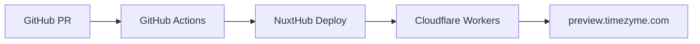

# Preview Deployment Setup Guide

This guide explains how to set up preview deployments for TimeZyme with a custom domain (preview.timezyme.com).

## Overview

The preview deployment system provides:
- Automatic deployments for pull requests
- Custom domain support (preview.timezyme.com)
- Isolated preview environment with sandbox credentials
- GitHub PR comments with deployment URLs

## Architecture



## Setup Instructions

### 1. GitHub Secrets Configuration

Add the following secrets to your GitHub repository:

- `NUXT_HUB_USER_TOKEN`: Your NuxtHub user token
- `NUXT_HUB_PROJECT_KEY_PREVIEW`: (Optional) Separate project key for preview deployments

### 2. NuxtHub Configuration

The preview deployment uses the same NuxtHub project but deploys as a preview environment. This ensures:
- Separate deployment URLs
- Isolated environment variables
- Independent scaling

### 3. Cloudflare DNS Configuration

To set up the custom domain `preview.timezyme.com`:

1. **Log in to Cloudflare Dashboard**
   - Navigate to your domain (timezyme.com)
   - Go to DNS settings

2. **Add CNAME Record**
   ```
   Type: CNAME
   Name: preview
   Target: timezyme-revq.nuxt.dev (or your NuxtHub deployment URL)
   Proxy status: Proxied (orange cloud)
   TTL: Auto
   ```

3. **Configure SSL/TLS**
   - Ensure SSL/TLS encryption mode is set to "Full" or "Full (strict)"
   - This ensures secure connections to your preview deployment

### 4. Environment Variables for Preview

The preview deployment automatically sets:
- `NUXT_PUBLIC_BASE_URL`: https://preview.timezyme.com
- `NUXT_PRIVATE_POLAR_SERVER`: sandbox
- `NUXT_PUBLIC_ADMIN_DEMO_MODE_ENABLED`: true

### 5. Workflow Configuration

Two workflows are available:

#### Option 1: Using GitHub Action (`.github/workflows/nuxthub-preview.yml`)
- Uses the official `nuxt-hub/action@v2`
- Suitable for standard deployments
- Includes preview branch synchronization

#### Option 2: Using CLI (`.github/workflows/preview-deployment.yml`)
- Uses `nuxthub deploy --preview` command
- More control over deployment process
- Simpler implementation

## Usage

### Automatic Deployments

1. Create a pull request against `main` or `develop`
2. The workflow automatically triggers
3. A comment appears on the PR with deployment URLs
4. Updates to the PR trigger new deployments

### Manual Deployments

Trigger a manual deployment using GitHub Actions:
1. Go to Actions tab
2. Select "Preview Deployment" workflow
3. Click "Run workflow"
4. Select the branch to deploy

### Deployment URLs

Each deployment provides two URLs:
- **Custom Domain**: https://preview.timezyme.com
- **Direct URL**: https://[hash].timezyme-revq.workers.dev

## Environment Differences

| Feature | Production | Preview |
|---------|------------|---------|
| Domain | timezyme.com | preview.timezyme.com |
| Polar Environment | Production | Sandbox |
| Demo Mode | Disabled | Enabled |
| Authentication | Enabled | Configurable |
| Database | Production | Shared/Isolated |

## Troubleshooting

### DNS Propagation
- Custom domain may take 5-15 minutes to become active
- Check DNS propagation using: `dig preview.timezyme.com`

### SSL Certificate Issues
- Cloudflare automatically provisions SSL certificates
- If issues persist, check SSL/TLS settings in Cloudflare

### Deployment Failures
- Check GitHub Actions logs for detailed error messages
- Verify NuxtHub token is valid and has correct permissions
- Ensure all required environment variables are set

### Preview Not Updating
- Clear Cloudflare cache for preview.timezyme.com
- Check if the deployment completed successfully
- Verify the CNAME record points to the correct target

## Security Considerations

1. **Sandbox Credentials**: Preview always uses sandbox payment credentials
2. **Authentication**: Consider enabling authentication for sensitive previews
3. **Data Isolation**: Ensure preview uses separate database or isolated data
4. **Access Control**: Use Cloudflare Access to restrict preview access if needed

## Best Practices

1. **Branch Naming**: Use descriptive branch names for easy identification
2. **PR Templates**: Include preview URL section in PR templates
3. **Cleanup**: Remove old preview deployments periodically
4. **Monitoring**: Set up alerts for preview deployment failures
5. **Testing**: Always test critical features in preview before merging

## Advanced Configuration

### Multiple Preview Environments

To support multiple preview environments (e.g., staging, QA):

1. Create additional CNAME records (staging.timezyme.com, qa.timezyme.com)
2. Modify workflows to deploy to specific environments based on branch patterns
3. Use environment-specific secrets and variables

### Custom Headers

Add custom headers for preview deployments in `nuxt.config.ts`:

```typescript
nitro: {
  routeRules: {
    '/**': {
      headers: {
        'X-Deployment-Type': 'preview',
        'X-Robots-Tag': 'noindex, nofollow'
      }
    }
  }
}
```

### Cloudflare Access Integration

To restrict access to preview deployments:

1. Enable Cloudflare Access for preview.timezyme.com
2. Configure authentication methods (email, social, etc.)
3. Set access policies based on your team structure

## Maintenance

### Regular Tasks

- Review and clean up old preview deployments monthly
- Update workflow dependencies quarterly
- Audit access logs for security
- Monitor deployment success rates

### Monitoring

Set up monitoring for:
- Deployment success/failure rates
- Preview environment uptime
- DNS resolution for custom domain
- SSL certificate expiration

## Support

For issues or questions:
- Check NuxtHub documentation: https://hub.nuxt.com/docs
- Review Cloudflare Workers docs: https://developers.cloudflare.com/workers
- Open an issue in the repository